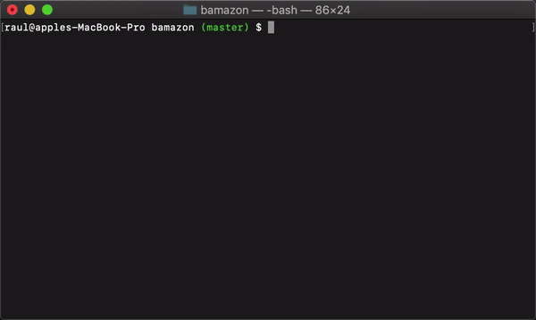
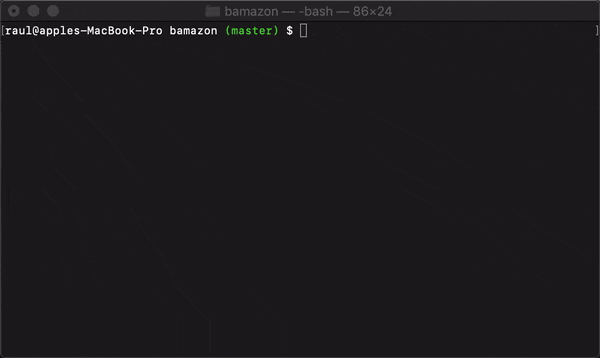
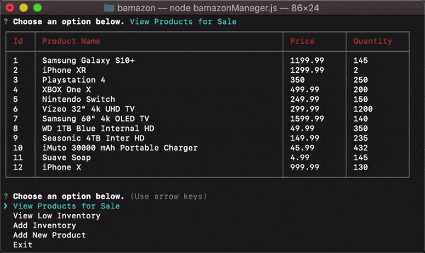
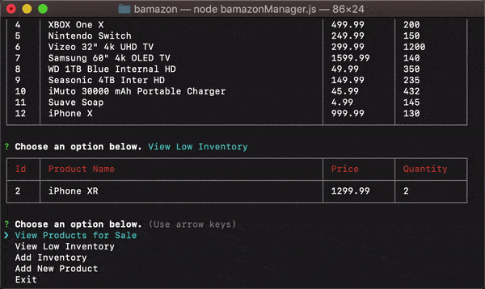
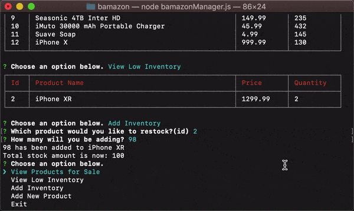

# Bamazon
## What is Bamazon?
Bamazon is an e-commerce app that has the functionality of buying items as a customer and restocking and adding products as a manager. This uses node with the `mysql`,`inquirer`, and `cli-table2` npm modules.

## How to use it
Make sure you have [git](https://git-scm.com/book/en/v2/Getting-Started-Installing-Git) and [node](https://nodejs.org/en/) installed.

Once installed, clone repo to your desired destination using `git clone https://github.com/rgonz166/bamazon.git`

Change your directory to downloaded repo folder.

Run `npm install` to download all the modules necessary to run the application.

## As Customer
To run the customer side run: `node bamazonCustomer.js`

1. Once entered, a table will appear with the available items to buy.

2. Enter the id number of the item you wish to buy and press `Enter on Windows||Return on Mac`.

3. Enter the amount you wish to purchase and press `Enter on Windows||Return on Mac`.

4. Congrats you have bought that amount of product.

## As Manager
To run the manager side run: `node bamazonManager.js`

There are 5 options to choose from:
1. View Products for Sale
2. View Low Inventory
3. Add Inventory
4. Add New Product
5. Exit

### View Products for Sale
This will display a full list of all the available items for sale.

### View Low Inventory
This option will list all the items that have a low quantity of 5 or less.

### Add Inventory
This option will add inventory to the product you choose using id.

### Add New Product
This option will prompt a series of question which will add a new product to the server.

### Exit
Simply exits the application.

# What I Learned
Throughout the project I learned the following things.
- How to properly use npm modules
- Use MySQL to store and access data.
- Using javascript and mysql node module, get access to MySQL database to get, insert and update items in my database.
- Use inquirer to prompt users for a better user experience.
- Use cli-table2 to properly display MySQL table to the terminal.